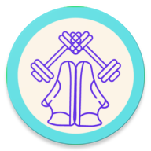

# WorkUp

Moving is hard. Between busy, sedentary lifestyles, staying inside, and the effort it takes to get going, WorkUp helps you work up to a more active lifestyle. With different types of movements for all different goals and ability levels. Whether you want to start stretching, walking, or dancing more often, WorkUp helps you get moving throughout the day with small, manageable, movements. Feeling competitive? WorkUp also allows you to connect with your friends to challenge, support, and reach your goals together through competitions that help everyone reach their own finish line. WorkUp also helps you track your steps by using your phones built in Pedometer to make tracking steps a breeze.
